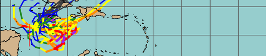

===========================
TCDiag-Realtime version |version|
===========================
Developed by the `Joint Numerical Testbed <https://dtcenter.org/>`_,
Boulder, CO

History
-------
The original tropical cyclone model diagnostics capability was originally developed for the Statistical Hurricane Intensity Prediction Scheme (SHIPS), and later as a stand-alone package called ‘Model Diagnostics’, by the Cooperative Institute for Research in the Atmosphere (CIRA). As of the METplus v6.0.0 / MET v12.0.0 release in early 2024, METplus now integrates these capabilities into an extensible framework called the TC-Diag tool. The goal of this tool is to provide the full set of CIRA's Model Diagnostics package in an platform-independent and extensible framework for reproducible verification.

The METplus documentation provide information on how to use the individual METplus components that are related to the TC model diagnosties capabilities, including the TCDiag Tool, TC-Pairs, database applications, and plotting. The purpose of this documentation is to provide additional guidance on how to install and use the TCDiag Realtime system's elaborated use cases in real-time and retrospective settings.

Acronyms
--------

* **MET** - Model Evaluation Tools
* **NCAR** - National Center for Atmospheric Research
* **NOAA** - National Oceanic and Atmospheric Administration
* **EMC** - Environmental Modeling Center
* **NHC** - National Hurricane Center

Authors
-------

To cite this documentation in publications, please refer to the TCDiag-Realtime User's Guide :ref:`Citation Instructions<citations>`.

* Jonathan Vigh [#NCAR]_
* Kate Musgrave [#CIRA_CSU]_
* John Halley Gotway [#NCAR]_
* Robert DeMaria [#CIRA_CSU]_
* George McCabe [#NCAR]_
* Minna Win-Gildenmeister [#NCAR]_
* Tatiana Burek [#NCAR]_
* Paul Kucera [#NCAR]_
* Tara Jensen [#NCAR]_

.. rubric:: Organization

.. [#NCAR] `National Center for Atmospheric Research, Research
       Applications Laboratory <https://ral.ucar.edu/>`_ 

.. [#CIRA_CSU] `Cooperative Institute for Research in the Atmosphere, Colorado State University <https://ral.ucar.edu/>`_

.. toctree::
   :hidden:
   :caption: TCDiag-Realtime 

   Users_Guide/index

Indices
=======

* :ref:`genindex`
* :ref:`modindex`
* :ref:`search`
